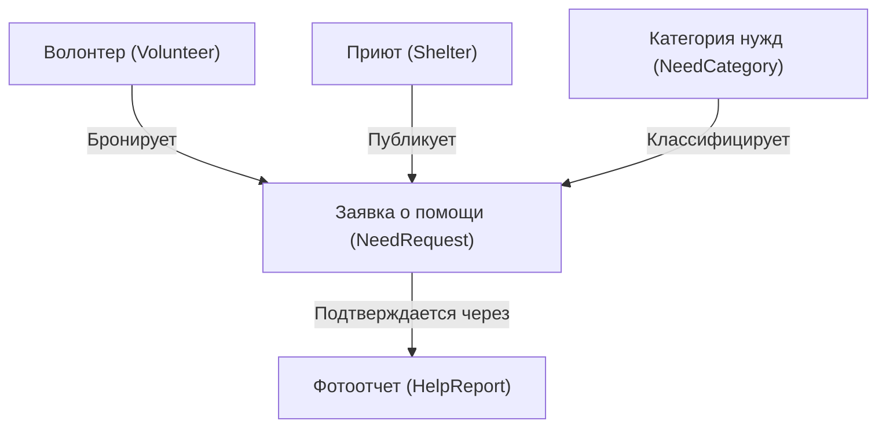

# Полная техническая документация: Система координации приютов (LPK Team)

Данный документ представляет собой исчерпывающее техническое руководство по устройству, архитектуре, компонентам и логике взаимодействия веб-приложения **Системы координации помощи животным в Пермском крае**. 

Проект разработан для перехода от разрозненных постов в социальных сетях к системному учету нужд через единый реестр. Он автоматизирует процессы публикации заявок приютами, бронирования и фотоотчетов волонтеров, а также проверку документов модераторами.

В этой документации технические термины и идентификаторы кода переведены на понятный русский язык для лучшего семантического восприятия системы, сохраняя при этом технические привязки.

---

## 🗺️ Картография папок и файлов проекта (Project Directory Map)

Ниже представлена полная структура файлов репозитория с описанием назначения каждого критического компонента.

```
d:\ShelterWebApp
├── GEMINI.md                            # Главные правила разработки и бизнес-логика (MVP Scope)
├── index.html                           # Главный HTML-шаблон для монтирования React SPA
├── package.json                         # Зависимости и скрипты сборки клиентской части (Vite + React)
├── vite.config.js                       # Конфигурация Vite, включая настройки проксирования /api -> бэкенд
│
├── src                                  # --- КЛИЕНТСКАЯ ЧАСТЬ (FRONTEND) ---
│   ├── main.jsx                         # Точка входа React, рендеринг App в DOM с BrowserRouter
│   ├── App.jsx                          # Корневой компонент: разметка градиентного фона и карта маршрутизации
│   ├── index.css                        # Глобальные стили приложения (Tailwind импорты и кастомные шрифты)
│   │
│   ├── contexts
│   │   └── AuthContext.jsx              # Управление сессией JWT, детальным профилем и безопасным слиянием PUT
│   │
│   ├── components
│   │   ├── Icons.jsx                    # Набор переиспользуемых премиальных SVG-иконок для ролей и кнопок
│   │   ├── ImageLightbox.jsx            # Компонент для полноэкранного просмотра сканов документов и фотоотчетов
│   │   ├── ProtectedRoute.jsx           # Защитник роутов (Route Guard), ограничивающий доступ по ролям пользователей
│   │   ├── SuccessModal.jsx             # Всплывающее окно успеха с плавной анимацией масштабирования
│   │   └── WarningModal.jsx             # Окно предупреждения с описанием ошибок заполнения форм
│   │
│   └── pages
│       ├── Home.jsx                     # Главный лендинг с динамической статистикой и карточками ролей
│       ├── RegisterVolunteer.jsx        # Форма регистрации волонтеров с валидацией номера телефона
│       ├── RegisterShelter.jsx          # Форма регистрации приюта с опциональным прикреплением документа
│       ├── LoginVolunteer.jsx           # Страница входа для волонтеров
│       ├── LoginShelter.jsx             # Страница входа для администраторов приютов
│       ├── LoginAdmin.jsx               # Страница входа для системного модератора (Администратора)
│       ├── VolunteerDashboard.jsx       # Лента заявок приютов с фильтрацией по 5 категориям и поиском
│       ├── VolunteerProfile.jsx         # Профиль волонтера с историей помощи и счетчиком "Спасено хвостиков"
│       ├── ShelterProfile.jsx           # Профиль приюта с настройками, загрузкой доков и статусом верификации
│       ├── ShelterRequests.jsx          # Персональная лента приюта для отслеживания его собственных нужд
│       ├── CreateEditRequest.jsx        # Экран создания/редактирования нужды с блокировкой для неверфицированных
│       ├── ReportUpload.jsx             # Страница отправки фотоотчета волонтера (выбор заявки + Drag-and-Drop)
│       ├── ReportVerification.jsx       # Экран проверки присланных отчетов приютом
│       └── AdminVerification.jsx        # Панель системного модератора для проверки и верификации приютов
│
└── ShelterWebApp.Api                    # --- СЕРВЕРНАЯ ЧАСТЬ (BACKEND) ---
    ├── Program.cs                       # Точка входа API: DI-контейнер, CORS, JWT-схемы, конвейер Middleware
    ├── appsettings.json                 # Настройки подключения к БД PostgreSQL, параметры JWT и логирования
    ├── ShelterCoordinationSystem.csproj # Зависимости бэкенда (EF Core, Npgsql, BCrypt, JwtBearer)
    │
    ├── Middleware
    │   └── GlobalExceptionMiddleware.cs # Глобальный перехватчик ошибок: возврат JSON с деталями ошибок
    │
    ├── Data
    │   ├── ApplicationDbContext.cs      # Контекст EF Core, маппинг сущностей в таблицы БД и Seed-данные
    │   ├── Configurations               # Конфигурации маппинга таблиц через Fluent API
    │   └── Entities                     # Классы сущностей БД (Shelter, Volunteer, NeedRequest, HelpReport, etc.)
    │
    ├── Dtos                             # Data Transfer Objects (Request/Response модели)
    │   ├── Auth                         # DTO для входа, регистрации и безопасного редактирования профилей
    │   ├── HelpReport                   # DTO для отправки и модерации отчетов о помощи
    │   └── NeedRequest                  # DTO для создания, обновления и отдачи заявок
    │
    └── Services                         # --- СЕРВИСНЫЙ СЛОЙ (БИЗНЕС-ЛОГИКА) ---
        ├── IAuthService.cs / AuthService.cs
        ├── INeedRequestsService.cs / NeedRequestsService.cs
        ├── IHelpReportsService.cs / HelpReportsService.cs
        └── IAdminService.cs / AdminService.cs
```

---

## 💾 База данных: Схема данных и связи (Описательная схема)

База данных работает на СУБД **PostgreSQL**. Взаимодействие построено на подходе **EF Core Code-First**. Сущности БД разделены DTO-пакетами и не возвращаются напрямую клиенту.



### Основные сущности (Entities)

1. **Сущность «Волонтер» (Volunteer):**
   * Представляет собой учетную запись человека, готового оказать помощь приюту.
   * Хранит персональные данные: Имя, Номер телефона, Email, Хэш пароля.
   * Содержит системный статус активности профиля и инкрементируемый счетчик выполненных задач **«Спасено хвостиков»** (`TotalHelped`).

2. **Сущность «Приют для животных» (Shelter):**
   * Описывает карточку приюта в системе.
   * Содержит юридическую и фактическую информацию: Название, Юридический адрес, Фактический адрес, Телефон для связи, Email.
   * Оснащена статусом прохождения модерации приюта (**Верифицирован / Не верифицирован**) и бинарными данными загруженного регистрационного документа (массив байт файла скана, имя файла, MIME-тип).

3. **Сущность «Заявка о помощи» (NeedRequest):**
   * Ключевой элемент бизнес-логики. Описывает конкретную нужду приюта (например, корм или перевозка).
   * Содержит описание, требуемое количество, дату создания и обновления.
   * Отслеживает жизненный цикл через поле статуса: **«Открыта»** (Open), **«В работе»** (InProgress), **«На проверке»** (OnVerification), **«Закрыта»** (Closed).
   * Имеет связи с создавшим её приютом и волонтером, забронировавшим её (поле волонтера остается пустым, пока заявка открыта).

4. **Сущность «Фотоотчет о помощи» (HelpReport):**
   * Служит доказательством выполнения заявки волонтером.
   * Хранит бинарные данные фотографии/чека (массив байт изображения), комментарий волонтера, дату отправки и статус проверки приютом (Ожидает проверки, Одобрен, Отклонен с указанием причины).

5. **Сущность «Системный администратор» (Admin):**
   * Профиль сотрудника/модератора платформы.
   * Используется для авторизации в панели верификации документов приютов.

### Связи и конфигурация Fluent API
Связи между сущностями настроены в контексте базы данных:
* **Связь «Приют ➜ Заявки» (один-ко-многим):** Один приют может создавать множество заявок о помощи. При удалении приюта из базы все его заявки каскадно удаляются.
* **Связь «Волонтер ➜ Заявки» (один-ко-многим):** Волонтер может взять в работу несколько заявок. Поле связи в заявке является необязательным (`nullable`), так как в момент создания заявка открыта для всех волонтеров.
* **Связь «Заявка ➜ Фотоотчет» (один-к-одному):** К одной заявке прикрепляется ровно один фотоотчет для проверки. При удалении заявки связанный с ней отчет удаляется автоматически.

---

## ⚙️ Уровень Backend: Архитектура процессов и бизнес-логики (API Layer)

Бэкенд строго следует принципам **SOLID** и разделению ответственности:
1. **Контроллеры** занимаются обработкой HTTP-запросов, разбором токенов авторизации и возвратом стандартизированных ответов.
2. **Бизнес-сервисы** инкапсулируют всю ключевую логику манипулирования данными и транзакции к базе данных.

### 1. Сервис Аутентификации и работы с профилями (AuthService)
* **Метод авторизации пользователей (`LoginAsync`):**
  Универсальный шлюз. Проверяет наличие email сначала среди волонтеров, затем среди приютов. Проводит сравнение паролей с использованием хэш-функции **BCrypt**. Генерирует и подписывает JWT-токен с указанием конкретной роли.
* **Метод обновления данных профиля (`UpdateProfileAsync`):**
  Осуществляет обновление текстовых настроек (имя, телефоны, адреса) в базе данных. Если пользователь ввел новый пароль в форму настроек, метод генерирует безопасный хэш `BCrypt.HashPassword` и перезаписывает его в БД, сбрасывая старый пароль.
* **Метод загрузки документа верификации приюта (`UploadShelterDocumentAsync`):**
  Принимает загруженный файл документа, считывает его бинарный поток в массив байтов и сохраняет в запись приюта, переводя статус верификации приюта в значение «Не верифицирован» (для ручной модерации администратором).

### 2. Сервис обработки заявок о помощи (NeedRequestsService)
* **Метод фильтрации и поиска заявок (`GetFilteredRequestsAsync`):**
  Использует ленивую загрузку LINQ запросов. Выполняет динамическую фильтрацию по текстовому поиску (поиск по описанию или названию приюта), статусу заявки и категориям на уровне СУБД, снижая нагрузку на память сервера.
* **Метод бронирования заявки волонтером (`BookRequestAsync`):**
  Закрепляет открытую заявку за волонтером, переводя её статус в «В работе» (InProgress). Метод защищен от повторного бронирования другими волонтерами на уровне валидации статуса.
* **Метод отмены бронирования (`ReleaseRequestAsync`):**
  Освобождает ранее забронированную заявку, стирая ID волонтера и возвращая статус заявки в значение «Открыта» (Open).

### 3. Сервис верификации отчетов о помощи (HelpReportsService)
* **Метод отправки отчетов волонтером (`SubmitReportAsync`):**
  Создает запись фотоотчета в базе данных, конвертируя загруженное изображение чека/фотографии в бинарный массив, прикрепляет его к заявке и меняет статус заявки на «На проверке» (OnVerification).
* **Метод проверки отчетов приютом (`ReviewReportAsync`):**
  * В случае **одобрения** отчета: статус отчета переходит в «Подтвержден», статус самой заявки меняется на «Закрыта» (Closed), а волонтеру, выполнившему задачу, в профиль начисляется +1 в счетчик добрых дел («Спасено хвостиков»).
  * В случае **отклонения** отчета: статус отчета переходит в «Отклонен», сохраняется текстовое описание причины отказа, а статус заявки возвращается в «В работе» (InProgress), позволяя волонтеру загрузить исправленное фото/чек.

### 4. Сервис модерации приютов администратором (AdminService)
* **Метод получения неверфицированных приютов (`GetUnverifiedSheltersAsync`):**
  Фильтрует приюты, отдавая только те, которые прислали файлы документов, но еще не получили подтверждение модератора.
* **Метод принятия решения по верификации приюта (`VerifyShelterAsync`):**
  Одобряет статус приюта (выставляя флаг верификации в `true`) либо отклоняет его (полностью удаляя недействительные документы из базы данных, позволяя приюту подать заявку заново).

---

## 🎨 Уровень Frontend: Архитектура Клиента (UI & State Layer)

Клиентская часть представляет собой **Single Page Application (SPA)**, построенное на **React 19** и оптимизированное сборщиком **Vite**.

### 1. Глобальный Контекст Авторизации (`AuthContext.jsx`)
Предоставляет глобальное состояние авторизованной сессии, объект текущего волонтера или приюта (`user`) и методы управления авторизацией.

#### Безопасный метод синхронизации данных профиля (`updateUser`):
```javascript
const updateUser = async (newData) => {
  if (user) {
    // 1. Опережающее локальное обновление состояния UI для отзывчивости
    setUser(prev => ({ ...prev, ...newData }));

    // 2. Защита от холостых PUT-запросов (проверяем, есть ли реальные поля профиля)
    const hasProfileFields = Object.keys(newData).some(key => 
      ['name', 'legalAddress', 'physicalAddress', 'phone', 'email', 'password'].includes(key)
    );

    if (!hasProfileFields) return; // Обновляем только локальный стейт React

    try {
      const token = localStorage.getItem('token');
      
      // 3. Безопасное слияние с текущим стейтом для исключения отправки undefined/null
      const payload = {
        name: newData.name !== undefined ? newData.name : user.name,
        legalAddress: newData.legalAddress !== undefined ? newData.legalAddress : user.legalAddress,
        physicalAddress: newData.physicalAddress !== undefined ? newData.physicalAddress : user.physicalAddress,
        phone: newData.phone !== undefined ? newData.phone : user.phone,
        email: newData.email !== undefined ? newData.email : user.email,
        password: newData.password || undefined
      };

      await fetch('/api/auth/profile', {
        method: 'PUT',
        headers: {
          'Content-Type': 'application/json',
          'Authorization': `Bearer ${token}`
        },
        body: JSON.stringify(payload)
      });
    } catch (err) {
      console.error("Ошибка при сохранении профиля на сервере:", err);
    }
  }
};
```

### 2. Ключевые компоненты (Components)
* **`ProtectedRoute.jsx`:** 
  Защищает приватные маршруты от неавторизованного доступа. Проверяет роль пользователя и перенаправляет на соответствующую страницу входа в случае нарушения прав.
* **`ImageLightbox.jsx`:**
  Модальное окно для полноэкранного детального изучения фотографий отчетов или сканов документов без перезагрузки страниц.
* **`SuccessModal.jsx` / `WarningModal.jsx`:**
  Всплывающие диалоговые окна с поддержкой анимации масштабирования и адаптивной версткой.

### 3. Функциональные страницы (Pages)
* **`Home.jsx`:**
  Главный лендинг с динамической статистикой и карточками ролей. Загружает реальную статистику закрытых нужд системы в реальном времени с помощью эндпоинта `/api/needrequests/stats`.
* **`VolunteerDashboard.jsx`:**
  Интерфейс поиска нужд. Содержит панель фильтрации по 5 категориям (`Корм`, `Медикаменты`, `Хозтовары`, `Транспорт`, `Руки/Выгул`) и строку поиска.
* **`ShelterProfile.jsx`:**
  Интерфейс администрирования приюта. Интегрирует Drag-and-Drop для отправки файлов на верификацию. Статус верификации вычисляется динамически:
  ```javascript
  {user.isVerified ? (
    <span className="text-[#758A6A]">Верифицирован</span>
  ) : user.hasDocument ? (
    <span className="text-[#D1B89B]">на модерации</span>
  ) : (
    <span className="text-red-500">документы не загружены</span>
  )}
  ```
* **`CreateEditRequest.jsx`:**
  Форма публикации заявок приюта. Включает в себя проверку на блокировку: неверфицированные приюты видят только экран заглушки:
  * Если `user.hasDocument === true`: экран **«Документы на модерации»**.
  * Если `user.hasDocument === false`: экран **«Документы не загружены»** с красным предупреждением и ссылкой на форму загрузки документов в профиле.

---

## 🔒 Пошаговый Жизненный Цикл Аутентификации (JWT Flow)

Процесс аутентификации является полностью безопасным и бесстейтовым (Stateless JWT):

```
[Пользователь]                         [Frontend React]                        [Backend .NET]
      |                                       |                                       |
      |--- 1. Вводит логин/пароль ------------>|                                       |
      |                                       |--- 2. POST /api/auth/login ---------->|
      |                                       |                                       |-- 3. Ищет в БД (Volunteer/Shelter)
      |                                       |                                       |-- 4. Сверяет BCrypt хэш пароля
      |                                       |                                       |-- 5. Подписывает JWT токен ключом
      |                                       |<-- 6. Отдает {Token, Role} -----------|
      |                                       |                                       |
      |                                       |--- 7. Сохраняет Token в LocalStorage  |
      |                                       |--- 8. GET /api/auth/me (с токеном) -->|
      |                                       |                                       |-- 9. Декодирует JWT, ищет профиль
      |                                       |<-- 10. Возвращает полные данные ------|
      |                                       |                                       |
      |<-- 11. Перенаправляет в кабинет -------|                                       |
```

---

## 📂 Пошаговый механизм загрузки файлов (File Upload Pipeline)

Загрузка документов верификации и фотоотчетов проходит следующий путь:
1. **Frontend (Выбор файла):** Волонтер или Приют прикрепляет изображение в форму (`<input type="file" accept="image/*">`). Файл валидируется на стороне React (проверка MIME-типа `image/*`).
2. **Frontend (Упаковка в HTTP):** Создается объект `window.FormData()`. Файл упаковывается с ключом `'document'`. Вызывается метод `fetch` с методом `POST` без ручного указания заголовка `Content-Type` (браузер автоматически выставляет заголовок `multipart/form-data` и прописывает уникальный `boundary` разделитель).
3. **Backend (Парсинг):** Контроллер принимает параметры через атрибут `[FromForm]`. Поток считывается бэкендом:
   ```csharp
   using var ms = new MemoryStream();
   await document.CopyToAsync(ms);
   byte[] documentBytes = ms.ToArray();
   ```
4. **Backend (Запись в БД):** Массив байтов записывается в поле типа `bytea` сущности в PostgreSQL, после чего сохраняется транзакцией `await _context.SaveChangesAsync()`.
5. **Backend (Отдача файла):** При запросе файла модератором или приютом (например, GET `/api/admin/shelters/{id}/document`), контроллер считывает байты из базы и отдает их как поток файлов с указанием оригинального имени и MIME-типа:
   ```csharp
   return File(shelter.RegistrationDocumentsData, shelter.RegistrationDocumentContentType, shelter.RegistrationDocumentFileName);
   ```

---

## 🚀 Руководство по развертыванию и запуску (Setup & Deployment Manual)

### Требования к окружению (Prerequisites)
1. Установленный **.NET 8.0 SDK**.
2. Установленная **Node.js** (версия 18 или выше).
3. Запущенный экземпляр **PostgreSQL** на порту `5432` с базой данных `ShelterCoordination`.

### Шаг 1: Настройка Базы Данных (Backend Configuration)
Откройте файл `d:\ShelterWebApp\ShelterWebApp.Api\appsettings.json` и настройте вашу строку подключения:
```json
"ConnectionStrings": {
  "DefaultConnection": "Host=localhost;Port=5432;Database=ShelterCoordination;Username=ВАШ_ПОЛЬЗОВАТЕЛЬ;Password=ВАШ_ПАРОЛЬ"
}
```

### Шаг 2: Применение миграций и запуск бэкенда
Перейдите в папку бэкенда и запустите процесс миграции базы данных и запуск сервера:
```bash
# Переход в каталог API
cd d:\ShelterWebApp\ShelterWebApp.Api

# Восстановление зависимостей NuGet
dotnet restore

# Применение миграций к БД PostgreSQL (БД создается автоматически)
dotnet ef database update

# Запуск бэкенд-сервера
dotnet run
```
Сервер запустится на порту `5045`: `http://localhost:5045`.

### Шаг 3: Установка зависимостей и запуск фронтенда
Откройте второй терминал, перейдите в корневой каталог проекта и выполните запуск Vite:
```bash
# Переход в корень проекта
cd d:\ShelterWebApp

# Установка npm-пакетов
npm install

# Запуск сервера разработки
npm run dev
```
Фронтенд запустится на порту `5173` или `5174`. Перейдите по адресу `http://localhost:5173` (или указанному в консоли порту) в вашем браузере.

### Шаг 4: Продакшн-сборка (Production Build)
При необходимости собрать оптимизированный бандл для деплоя на хостинг:
* **Backend:** `dotnet publish -c Release`
* **Frontend:** `npm run build` (результат сборки будет находиться в папке `dist/`).
